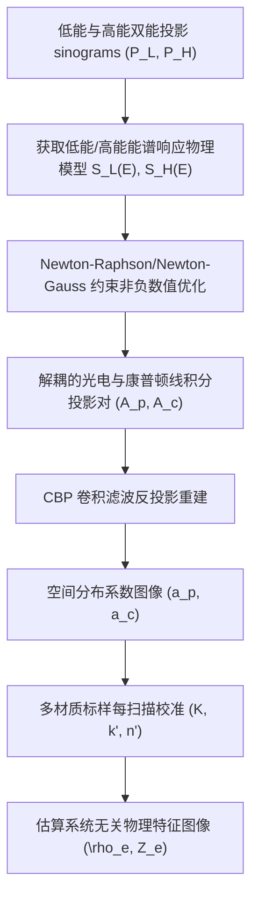

# 《利用双能计算机断层扫描实现材料表征的系统无关性方法》详细学术阅读报告

本报告针对 Stephen G. Azevedo 等发表于 IEEE Transactions on Nuclear Science (Vol. 63, No. 1, 2016) 的经典学术论文 《System-Independent Characterization of Materials Using Dual-Energy Computed Tomography》（利用双能计算机断层扫描实现材料表征的系统无关性方法）进行系统化梳理，详细介绍其物理原理、实验设计与数据校准方法，以及精度与准确度评估结果，并分析其对目前“双能 X 射线透射 (XRT) 矿石品位识别及原子序数解耦”项目的学术与工程指导意义。

---

## 一、 论文概述与核心问题

传统的单能 CT 或双能 CT (DECT) 在进行物体成像时，其所测量的**线衰减系数 ($\mu$)** 深度依赖于特定扫描设备的**能谱响应 (System Spectral Response)**（包括射线源能量分布、靶材角度、滤片材质与厚度、探测器材料与积分时间等）。这导致相同物质在不同扫描设备、甚至在同一设备的不同工作电压或曝光时间下，测得的图像灰度和衰减特征存在显著偏差。

此外，传统方法在解决**能谱硬化 (Beam Hardening)** 时，通常使用基于水等单一参考物质的能谱硬化补偿 (BHC)，这会使重建图像带有明显的“杯状伪影 (Cupping Artifacts)”，且对高原子序数或高异质性的复杂材料（如重金属矿石）完全失效。

为了实现**系统/设备无关性 (System-Independence)** 的定量材料表征，论文提出了一种基于物理规律的全新双能 CT 分解方法——**SIRZ (System-Independent Rho-e/Z-e)** 算法。该方法：
1. **直接引入设备能谱的物理描述**，将光谱硬化过程融合至正向方程中解算，从源头上免去了传统硬化补偿的步骤。
2. 提出了一种全新、与射线源能谱无关的物理特征变量空间——**电子密度 ($\rho_e$)** 与**系统无关有效原子序数 ($Z_e$)**，可实现跨能谱、跨设备的物理参数高精度重现。

---

## 二、 核心物理与数学原理

SIRZ 算法的核心物理思想是利用 X 射线在诊断能量区间（30 至 200 keV）内与物质相互作用的两种主要物理效应（光电效应和康普顿散射）进行特征空间重构。

### 1. Alvarez-Macovski 光电-康普顿衰减分解
在 30 ~ 200 keV 能量范围内，任何各向同性材料的线衰减系数 $\mu(E)$ 可以高精度地近似分解为两分量之和：
$$\mu(E) = a_p E^{-3} + a_c f_{\text{KN}}(E)$$

其中：
- $E$ 为光子能量（单位：keV）。
- $a_p$ 和 $a_c$ 分别是材料特有的**光电效应衰减系数**与**康普顿散射衰减系数**。
- $E^{-3}$ 近似代表光电截面随能量的剧烈衰减规律。
- $f_{\text{KN}}(E)$ 为自由电子克莱因-仁科 (Klein-Nishina) 散射截面公式：
  $$f_{\text{KN}}(\alpha) = \frac{1+\alpha}{\alpha^2} \left[ \frac{2(1+\alpha)}{1+2\alpha} - \frac{1}{\alpha}\ln(1+2\alpha) \right] + \frac{1}{2\alpha}\ln(1+2\alpha) - \frac{1+3\alpha}{(1+2\alpha)^2}$$
  其中 $\alpha = E / m_e$，而 $m_e = 510.999 \text{ keV}$ 是电子的静止质量。

### 2. 经典有效原子序数 $Z_{\text{eff}}$ 的物理局限
传统的有效原子序数 $Z_{\text{eff}}$ 普遍沿用 Mayneord (1937) 的经验公式：
$$Z_{\text{eff}} = \left( \sum_{i=1}^N r_i Z_i^p \right)^{1/p}$$
其中 $r_i$ 为元素 $i$ 的相对电子比例：
$$r_i = \frac{n_i Z_i}{\sum_{j=1}^N n_j Z_j}$$
$n_i$ 为原子数密度，而指数 $p$ 通常被经验性地设为 2.94（或根据特定实验优化至 3.80）。

**局限性分析**：
- **物理机理缺失**：Mayneord 公式是非物理推导的经验公式，未真正联系电子相互作用截面。
- **能谱依赖性高**：对于包含多元复杂元素或高原子序数（$Z > 15$）的复合介质，并不存在一个放之四海而皆准的指数 $p$。不同电压下计算出的 $Z_{\text{eff}}$ 漂移严重。

### 3. 系统无关物理特征空间：$(\rho_e, Z_e)$

为了克服上述局限，SIRZ 引入了严格基于物理截面的参数空间 $(\rho_e, Z_e)$：

#### (1) 电子密度 $\rho_e$ (Electron Density)
X 射线的康普顿散射在物理上只与材料中的单位体积电子数直接相关。质量密度 $\rho$ 受到核外中子比例波动的影响，而电子密度 $\rho_e$（单位：$\text{moles-e}^-/\text{cm}^3$）则是纯物理的相互作用决定量：
$$\rho_e = \sum_{i=1}^N \frac{Z_i}{A_i} \rho$$
其中 $A_i$ 是元素的相对原子质量，$\rho$ 是宏观质量密度。由于其与康普顿散射截面具有严格的直接比例关系，可由解算出的康普顿衰减系数 $a_c$ 直接估算：
$$\hat{\rho}_e = K \cdot a_c$$
（其中 $K$ 为系统设备校准常数）。

#### (2) 新有效原子序数 $Z_e$ (Effective Atomic Number)
$Z_e$ 被定义为在所关注的宽能谱能量范围内容抗衡该多元素化合物 X 射线透射率效果的最佳“单质原子序数”。
对于由 $N$ 种元素组成的分子材料 $Y$，根据 Beer-Lambert 定律，其多能透射系数 $T_Y(E)$ 为：
$$T_Y(E) = \exp \left[ -M_Y \sum_{i=1}^N r_i \sigma_e(Z_i, E) \right]$$
其中 $M_Y$ 为面积电子密度，$\sigma_e(Z_i, E)$ 为从标准数据库（如 LLNL 的 EPDL97）中获取的元素 $Z_i$ 在能量 $E$ 下的**总电子截面**（包含光电、相干与非相干散射截面之和，单位：$\text{cm}^2/\text{electron-mole}$）。

我们定义一个假想非整数单质元素 $Z_e = Z + \delta$（其中 $Z = \lfloor Z_e \rfloor$ 为整数部分，$\delta$ 为 fractional 小数偏置），其等效电子截面通过相邻整数元素插值得到：
$$\sigma_{Z_e}(E) = (1-\delta)\sigma_e(Z, E) + \delta\sigma_e(Z+1, E)$$
其等效透射率为：
$$T_{Z_e}(E) = \exp \left[ -M_Y \sigma_{Z_e}(E) \right]$$

物理上的 $Z_e$ 就是在目标能谱区间内，使该假想单质与原多元素化合物的透射率误差平方和达到最小的值：
$$Z_e = \arg\min_{Z_e} \left\{ \int [T_{Z_e}(E) - T_Y(E)]^2 dE \right\}$$
该定义**天然地将材料截面物理与能谱分布结合起来**，从理论上杜绝了 Mayneord 公式在多元高序数混合物中的精度坍塌。

根据光电与康普顿贡献的解析关系，$Z_e$ 可由重建图像中的 $a_p$ 和 $a_c$ 估算：
$$\hat{Z}_e = k' \left( \frac{a_p}{a_c} \right)^{1/n'}$$
（其中 $k'$ 和 $n'$ 为系统校准常数）。

---

## 三、 SIRZ 算法与实验方法

SIRZ 的解算和实验验证流程是一个结合物理模拟、约束数值优化以及实验数据对齐的严密管线。

### 1. 双能光谱正向投影模型与优化解耦

在介绍优化算法前，必须首先明确实验观测值 **$P_L$（低能对数衰减投影）** 与 **$P_H$（高能对数衰减投影）** 的物理实质与数学来源。

#### (1) 对数衰减投影 $P_L, P_H$ 的物理实质与定义
对数衰减投影 (Logarithmic Attenuation Projection) 是基于 **Beer-Lambert（比尔-朗伯）吸收定律** 衍生出来的描述 X 射线穿过介质后整体衰减强度的无量纲物理量。

* **单色光场景 (Monochromatic X-ray)**：
  如果 X 射线是单一能量 $E$ 的单色光，入射光强为 $I_0(E)$，穿过物体出射后的透射光强为 $I(E)$，满足指数衰减关系：
  $$I(E) = I_0(E) \exp\left(-\int \mu(s, E) ds\right)$$
  两边取负对数，即可得到对数衰减投影 $P(E)$：
  $$P(E) = -\ln\left(\frac{I(E)}{I_0(E)}\right) = \ln\left(\frac{I_0(E)}{I(E)}\right) = \int \mu(s, E) ds$$
  在单色光下，对数投影与线衰减系数沿射线的**线积分值**具有严格的等价线性关系，这是传统单色 CT 重建的基础。

* **多色光场景 (Polychromatic X-ray，实际双能实验)**：
  但在实际的 X 射线管中，射线源产生的是宽能谱的连续多色光。设入射能谱分布为 $S(E)$，透过样品后的探测器像素总接收灰度/光强 $I$ 必须对全能谱进行积分累加：
  $$I = \int_0^{E_{\max}} S(E) \exp\left(-\int \mu(s, E) ds\right) dE$$
  当射线通道上没有样品阻挡时（即“空气扫描”或背景参考，满足 $\int \mu ds = 0$），探测器像素测得的入射背景总灰度 $I_0$ 为：
  $$I_0 = \int_0^{E_{\max}} S(E) dE$$
  因此，在实际双能实验中，低能通道投影 **$P_L$** 和高能通道投影 **$P_H$** 是通过探测器像素在两种电压/滤片组合下**实际测得的有样品透射灰度 $I$ 与无样品背景灰度 $I_0$** 按照如下方式直接计算得到的实验观测比值：
  $$P_L = -\ln\left(\frac{I_L}{I_{0,L}}\right) = \ln\left(\frac{I_{0,L}}{I_L}\right)$$
  $$P_H = -\ln\left(\frac{I_H}{I_{0,H}}\right) = \ln\left(\frac{I_{0,H}}{I_H}\right)$$

* **物理对应**：在我们实际的 XRT 数据提取代码中，低能图像像素值 `low` 和高能像素值 `high` 分别对应 $I_L$ 与 $I_H$；而入射无阻挡背景值 `I0_low` 和 `I0_high` 则对应 $I_{0,L}$ 与 $I_{0,H}$。

#### (2) 双能光谱正向投影模型
将多色积分式与 Alvarez-Macovski 分解代入对数衰减定义式中，即得到了低能通道 $P_L$ 和高能通道 $P_H$ 与待求解线积分 $A_p, A_c$ 的非线性物理正向映射方程：
$$P_L = -\ln\left\{ \frac{\int S_L(E) \exp\left[ -E^{-3} A_p - f_{\text{KN}}(E) A_c \right] dE}{\int S_L(E) dE} \right\}$$
$$P_H = -\ln\left\{ \frac{\int S_H(E) \exp\left[ -E^{-3} A_p - f_{\text{KN}}(E) A_c \right] dE}{\int S_H(E) dE} \right\}$$

利用对数的除法展开性质（$-\ln(A/B) = -\ln A + \ln B$），上式在数学上与论文所列格式完全等价：
$$P_L = -\ln\left\{ \int S_L(E) \exp\left[ -E^{-3} A_p - f_{\text{KN}}(E) A_c \right] dE \right\} + \ln \int S_L(E) dE$$
$$P_H = -\ln\left\{ \int S_H(E) \exp\left[ -E^{-3} A_p - f_{\text{KN}}(E) A_c \right] dE \right\} + \ln \int S_H(E) dE$$

其中：
- $A_p = \int a_p ds$ 和 $A_c = \int a_c ds$ 是光电与康普顿系数的线积分。
- $S_L(E)$ 和 $S_H(E)$ 是射线源与探测器组合的**系统光谱响应**。

**解耦数值算法**：
- 采用 **二维 Newton-Raphson 约束优化** 对每个像素通道的 $P_L, P_H$ 进行迭代，反解出非负物理量投影 $A_p \ge 0, A_c \ge 0$。
- **异常退化处理**：若优化进入非物理负值区间，则自动转换为带有 $A_p = 0$ 或 $A_c = 0$ 强约束的 **Newton-Gauss 优化** 算法，从而在数学上彻底消除局部噪声导致的物理振荡。

### 2. 探测器与射线源能谱物理建模
能谱响应模型 $S(E)$ 的准确性直接决定了解耦精度：
- **探测器能谱建模**：使用 **MCNP6 (Monte Carlo N-Particle)** 蒙特卡洛粒子输运软件对扁平阵列探测器进行全物理仿真，考虑闪烁体材料（如 $\text{Gd}_2\text{O}_2\text{S:Tb}$、$\text{Lanex Fine}$ / $\text{DRZ Plus}$）、外壳厚度以及光子-电子耦合沉积效应，将全谱细分为 40 个能级通道计算。
- **射线源能谱建模**：使用 semi-empirical 钨靶阳极模型（如 Poludniowski 和 Evans 模型），并在建模中对不同工作电压下添加的铝、铜、钢滤片进行光谱过滤微调，最终通过对已知样品的实验透射率进行参数匹配优化。

### 3. 四标样每扫描自动校准
为了抵消实验环境中由于温漂、散射和几何不重合引起的误差，SIRZ 在每次扫描的转盘上同轴安放了 4 种高纯度参考标样进行实时标定：
- **石墨 (Graphite, C)**：极低原子序数代表物质 ($\rho_e = 0.901, Z_e = 6.00$)。
- **纯水 (Water, $\text{H}_2\text{O}$)**：低原子序数与氢元素富集代表物质 ($\rho_e = 0.554, Z_e = 7.43$)。
- **纯镁 (Magnesium, Mg)**：中等原子序数单质 ($\rho_e = 0.858, Z_e = 12.00$)。
- **单晶硅 (Silicon, Si)**：较高原子序数单质 ($\rho_e = 1.162, Z_e = 14.00$)。

基于已知标样的 $(\rho_e, Z_e)$ 理论值以及重建出的 $(a_p, a_c)$，通过 Newton-Gauss 最小二乘法估计系统校准参数 $K$、$k'$ 和 $n'$。

---

## 四、 实验设计与定量化结果

### 1. 实验验证方案
为挑战 SIRZ 的设备与能谱无关性，研究设计了跨越不同硬件与物理位置的验证实验：
- **两台不同的工业 DECT 系统**：
  - **HE 系统**：配备 Thales Flashscan 33 探测器。
  - **TB 系统**：配备 PerkinElmer XRD 1620 探测器。
- **5 种异构能谱对（kV/滤片）**：
  1. `HE100/160` (100kV 配 1.94mm Al / 160kV 配 1.94mm Al + 1.91mm Cu)
  2. `TB100/160`
  3. `TB80/125`
  4. `TB125/200`
  5. `TB80/200`
- **挑战性试样**：
  - **均匀样块**：Graphite, POM, Water, PTFE, Magnesium, Silicon。
  - **非均匀混合试样**：直径 5cm 的 PTFE/POM 块体内切 4 孔，分别填装 Mg, POM, 水和空气。
  - **高原子序数外推边界样**：**19% (wt) RbBr 水溶液**。RbBr 的理论 $Z_e$ 达到了 $20.05 \pm 0.05$，远高出 4 标样校准空间的最大值（硅 $Z_e = 14.0$），极具挑战性。

### 2. 精度 (Precision) 对比结果
精度定义为在 5 种完全不同的扫描电压/能谱配置下，各材料解算出物理属性值的**标准偏差（变异系数，%）**。偏差越小，说明算法抗能谱波动、设备差异的能力越强（设备无关性越好）。

| 试样名称 | 理论有效原子序数 $Z_e$ | 传统 Ratio 法 偏差 (%) | 传统 YNC 算法 $Z_{\text{eff}}$ 偏差 (%) | SIRZ 算法 (本报告) $Z_e$ 偏差 (%) | SIRZ 算法 (本报告) $\rho_e$ 偏差 (%) |
| :--- | :---: | :---: | :---: | :---: | :---: |
| **石墨 (Graphite)** | 6.00 | 8.9% | 0.3% | **0.3%** | **0.5%** |
| **聚甲醛 (POM)** | 6.97 | 9.7% | 1.8% | **1.6%** | **0.7%** |
| **纯水 (Water)** | 7.39 | 10.1% | 1.4% | **1.3%** | **0.7%** |
| **特氟龙 (PTFE)** | 8.43 | 11.9% | 1.3% | **1.4%** | **0.7%** |
| **金属镁 (Magnesium)** | 12.00 | 18.0% | 1.0% | **1.4%** | **1.0%** |
| **单晶硅 (Silicon)** | 14.00 | 20.0% | 0.9% | **1.1%** | **1.1%** |
| **19% RbBr 水溶液 (高Z外推)** | 20.08 | 24.5% | 3.1% | **3.3%** | **6.2%** |

*数据解读*：
- 传统的 Ratio 法由于无任何硬化矫正与能谱约束，偏差高达 **8.9% ~ 24.5%**。
- YNC 算法虽然在低原子序数下通过参考物质表现尚可，但在密度代理（$\mu_{\text{high}}$）的计算上严重漂移，受光谱限制极大。
- **SIRZ 算法表现出惊人的谱独立性**，所有标定内的实体材料属性的标准变异系数**均严格控制在 2% 以内（基本在 0.5% ~ 1.5% 之间）**。即使是对外推区间的 RbBr 强衰减样品，也依然取得了 $Z_e$ 偏差仅 3.3% 的极佳精度。

### 3. 准确度 (Accuracy) 对比结果
准确度定义为解算出的物理属性均值与已知化学元素理论值之间的均方根误差 (RMS Error, %)。

| 试样名称 | SIRZ $\rho_e$ 平均误差 (%) | SIRZ $\rho_e$ 最大误差 (%) | SIRZ $Z_e$ 平均误差 (%) | SIRZ $Z_e$ 最大误差 (%) | YNC $Z_{\text{eff}}$ 平均误差 (%) | YNC $Z_{\text{eff}}$ 最大误差 (%) |
| :--- | :---: | :---: | :---: | :---: | :---: | :---: |
| **石墨 (Graphite)** | 2.1% | 2.7% | 2.5% | 2.6% | 2.9% | 3.1% |
| **聚甲醛 (POM)** | 2.3% | 3.4% | **0.3%** | 3.5% | 1.8% | 3.8% |
| **纯水 (Water)** | 2.0% | 3.6% | **0.3%** | 2.5% | 0.2% | 3.0% |
| **特氟龙 (PTFE)** | 2.0% | 3.1% | **0.3%** | 3.6% | 1.7% | 4.6% |
| **金属镁 (Magnesium)** | 2.3% | 4.4% | **0.5%** | 3.7% | 2.0% | 4.4% |
| **单晶硅 (Silicon)** | 1.2% | 2.7% | 2.5% | 3.7% | 2.3% | 3.0% |
| **19% RbBr 水溶液 (高Z外推)** | 8.4% | 18.0% | **3.8%** | **8.1%** | **20.0%** | **23.5%** |

*数据解读*：
- 在 80 至 200 keV 宽广能谱区间内，**SIRZ 算法估算的 $Z_e$ 准确度误差在低序数区域内稳定保持在 3% 以内**。
- **高 Z 样品的决胜对比**：对于 RbBr 样品，传统的 YNC 算法由于 Mayneord 物理局限，Zeff 误差**飙升至 20.0% ~ 23.5%**（完全失去工业识别意义）。而 **SIRZ 算法凭借扎实的物理电子截面理论，将 $Z_e$ 的 RMS 误差压低到了 3.8% (最大 8.1%)**。这证明了 SIRZ 在外推预测上的卓越物理鲁棒性。

### 4. 对系统模型误差的敏感性分析
论文最后探究了当能谱物理模型 $S(E)$ 与实际物理射线偏离时，SIRZ 算法的抗噪表现：
- **微小过滤器偏差**（$\pm 5\%$ 滤片厚度误差）：对低电压通道几乎无影响（$<0.6\%$），对高能谱通道中高序数物质（RbBr）产生最高 $4.2\%$ 误差。
- **电压漂移偏差**（射线管电压发生 $\pm 5\text{ kV}$ 漂移）：对一般材料的特征值产生最高约 $2.7\%$ 误差；在 RbBr 溶液中最大上升至 $11\%$ 误差。
- **结论**：SIRZ 的解算极度依赖准确的谱响应模型，但在工业现场，仅需每隔数周利用标样对模型进行物理反向微调，即可轻松消除漂移。

---

## 五、 对“双能 XRT 矿石品位识别”项目的核心指导意义

本篇论文对我们当前处理的**双能 XRT 块状矿石品位与有效原子序数解耦**具有极其重要的理论与算法应用指导作用：

1. **宏观 Jensen 不等式误差规避**
   - 论文在处理特征值计算时强调：“...the calculation need only be performed on scalar mean values for $a_p$ and $a_c$ in the object region. That way, the coefficient estimation... is done once per scan on the mean values inside each material region rather than calculating different estimates for each voxel.”
   - 这在物理上完美印证了我们在 2026-05-22 重构 `fit_hl_curve.py` 时所遵循的物理机制：**必须先对每个像素进行对数衰减计算物理厚度，然后再求均值（先 Log 后 Mean）**，不能先将灰度平均再取对数，否则由矿石的强异质性带来的几何起伏会引入严重的 Jensen 不等式误差，破坏特征线性度。

2. **从 R 值法向物理 $(\rho_e d, Z_e)$ 特征空间的映射演化**
   - 项目中目前广泛使用的 $R$ 值描述法（对数比值）其实就是论文中提出的 Ratio 方法的某种变体。
   - 随着矿石厚度的增加，高低能对数衰减由于**能谱硬化 (Beam Hardening)** 都会向低衰减区弯曲偏移，导致 $R$ 值发生随厚度变化的漂移。为了实现厚度解耦，必须引入基于光电效应（APD，代表 $a_p \cdot d$）与康普顿散射（ACD，代表 $a_c \cdot d$）的特征解耦。
   - 我们可以直接借鉴论文中的代数求解方式：
     $$Z_e \propto \left( \frac{apd}{acd} \right)^{1/n'} = \left( \frac{a_p}{a_c} \right)^{1/n'}$$
     因为 $apd$ 和 $acd$ 同时乘了物理厚度 $d$，**两者相除可完美消除未知几何厚度 $d$ 的物理纠缠**！

3. **异常像素过滤阈值的物理依据**
   - 矿石由于其极高的密度与异质性，经常发生部分区域光子“全吸收”的现象（即透射灰度值极低）。
   - 项目当前在 `utils_II.get_ore_lower_threshold` 中使用的 16-bit 像素下剔除 `< 2560`（8-bit下剔除 `< 10`）的保护阈值，其根本物理依据即是论文中提到的：**避免在低光子透射率（透射对数大于 3.5 以上，即底噪噪声占主导）的非有效区间进行物理拟合**，从而保证光电-康普顿系数解算不发生数学发散。
