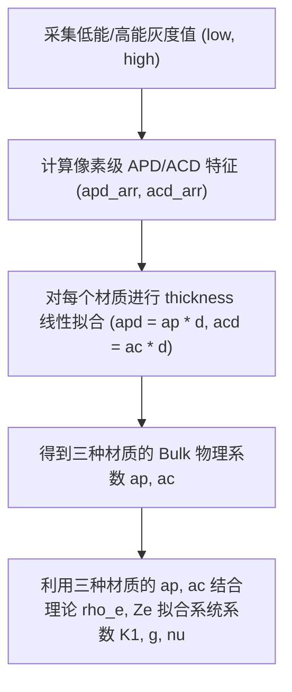

# 铜、铝、铁阶梯标样下的双能物理系数校准指南

基于三明治探测器及 System-Independent (SIRZ) 算法的等效单能近似框架，我们需要将实验测得的双能灰度投影值，最终校准转换到系统无关的两个物理特征空间：**电子密度 $\rho_e$** 与 **有效原子序数 $Z_e$**。

本指南提供使用已知材料与厚度参数的 **铜 (Cu)、铝 (Al)、铁 (Fe) 阶梯标样** 求解校准参数 $K_1$、$\nu$ 和 $g$ 的严密数学步骤及 Python 自动化校准代码模板。

---

## 一、 标样物理属性真值 (Ground Truth)

为了校准系统，我们必须已知这三种高纯度金属标样的理论原子序数 $Z$（单质中即为 $Z_e$）与理论电子密度 $\rho_e$。

### 1. 物理计算公式
- **等效原子序数 $Z_e$**：由于是高纯度单质金属，直接取其原子的核电荷数 $Z$。
- **电子密度 $\rho_e$**（单位：$\text{moles-e}^-/\text{cm}^3$）：
  $$\rho_e = \frac{Z}{A} \rho_{\text{mass}}$$
  其中 $Z$ 为原子序数，$A$ 为元素相对原子质量，$\rho_{\text{mass}}$ 为材料的质量密度（单位：$\text{g/cm}^3$）。

### 2. 三种标样理论常数表
| 标样材质 | 原子序数 $Z_e$ | 相对原子质量 $A$ | 质量密度 $\rho_{\text{mass}}\ (\text{g/cm}^3)$ | 理论电子密度 $\rho_e\ (\text{moles-e}^-/\text{cm}^3)$ |
| :--- | :---: | :---: | :---: | :---: |
| **铝阶梯 (Al)** | 13 | 26.9815 | 2.70 | **1.3008** |
| **铁阶梯 (Fe)** | 26 | 55.8450 | 7.87 | **3.6644** |
| **铜阶梯 (Cu)** | 29 | 63.5460 | 8.96 | **4.0888** |

---

## 二、 标样校准数学模型与步骤

校准流程分为三个阶段：**像素级特征求解** $\rightarrow$ **厚度拟合提取 Bulk 衰减系数** $\rightarrow$ **跨材质回归估计系统常数**。



### 【第一阶段】 计算像素级特征 $apd$ 与 $acd$
对于每个材质、每个厚度等级，首先使用估计出的等效平均能量 $E_{\text{LE}}$ 和 $E_{\text{HE}}$（例如根据 RQA5 能谱或我们的工作电压估算，例如低能 30 keV，高能 60 keV）以及 Klein-Nishina 系数计算出像素级特征 $apd$ 和 $acd$。
物理模型为：
$$\begin{bmatrix} apd \\ acd \end{bmatrix} = \begin{bmatrix} E_{\text{LE}}^{-3} & E_{\text{HE}}^{-3} \\ f_{\text{KN}}(E_{\text{LE}}) & f_{\text{KN}}(E_{\text{HE}}) \end{bmatrix}^{-1} \begin{bmatrix} \ln(I_{0,L} / I_L) \\ \ln(I_{0,H} / I_H) \end{bmatrix}$$

- $apd = a_p \cdot d$，表示光电衰减特征。
- $acd = a_c \cdot d$，表示康普顿衰减特征。
- $d$ 为对应阶梯的物理厚度。

---

### 【第二阶段】 直接通过厚度求解提取单点特征系数 $a_p$ 和 $a_c$
对于某一金属材质 $m \in \{\text{Al, Fe, Cu}\}$：
选取特定厚度阶梯 $d_k$（例如第 1、第 3 或第 5 个较薄的阶梯，以最大程度减小大厚度能谱硬化导致的物理模型扭曲），直接通过厚度除法解算出该阶梯的特征衰减系数 $a_p^{(m)}$ 和 $a_c^{(m)}$：

$$a_p^{(m)} = \frac{apd_k}{d_k}$$
$$a_c^{(m)} = \frac{acd_k}{d_k}$$

这排除了多阶梯线性平均所引入的非线性扭曲，更真实地反映特定能谱过滤品质下的基准系数。

---

### 【第三阶段】 多材质拟合估计系统校准常数 ($K_1, g, \nu$)

#### 1. 拟合电子密度常数 $K_1$
根据关系式：$\rho_e = K_1 \cdot a_c$。
我们已知三种材料的理论电子密度 $\rho_{e, \text{theory}}^{(m)}$ 和第二阶段拟合得到的 $a_c^{(m)}$。利用无截距最小二乘拟合，求解 $K_1$：
$$K_1 = \frac{\sum_{m \in \{\text{Al, Fe, Cu}\}} \rho_{e, \text{theory}}^{(m)} \cdot a_c^{(m)}}{\sum_{m \in \{\text{Al, Fe, Cu}\}} (a_c^{(m)})^2}$$

#### 2. 拟合原子序数常数 $\nu$ 和 $g$
根据关系式：
$$Z_e = g \left( \frac{a_p}{a_c} \right)^{1/\nu}$$
定义特征比例比值 $R_m = a_p^{(m)} / a_c^{(m)}$。两边同时取自然对数，将幂函数关系式转化为**线性方程组**：
$$\ln(Z_{e, m}) = \ln(g) + \frac{1}{\nu} \ln(R_m)$$

设定代数变量：
- $y_m = \ln(Z_{e, m})$
- $x_m = \ln(R_m)$
- $C_0 = \ln(g)$
- $C_1 = 1/\nu$

我们得到了经典的直线回归方程：$y_m = C_1 x_m + C_0$。
使用这三个金属标样的数据点对 $(x_m, y_m)$，通过一元线性回归（最小二乘法）求解斜率 $C_1$ 和截距 $C_0$：
$$\bar{x} = \frac{1}{3}\sum_m x_m, \quad \bar{y} = \frac{1}{3}\sum_m y_m$$
$$C_1 = \frac{\sum_m (x_m - \bar{x})(y_m - \bar{y})}{\sum_m (x_m - \bar{x})^2}$$
$$C_0 = \bar{y} - C_1 \bar{x}$$

最终，逆向解析出系统所需的有效原子序数物理参数：
$$\nu = \frac{1}{C_1}$$
$$g = \exp(C_0)$$

---

## 三、 Python 自动化校准代码模板

您可以直接运行以下 Python 脚本，读取我们的标样提取数据并自动计算出这三个校准常数。

```python
import numpy as np
import pickle
import os

# 1. 定义标样理论常数 (Ground Truth)
THEORY_DATA = {
    'Al_step': {'Z': 13.0, 'rho_e': 1.3008},
    'Fe_step': {'Z': 26.0, 'rho_e': 3.6644},
    'Cu_step': {'Z': 29.0, 'rho_e': 4.0888}
}

# 2. 设定计算 apd/acd 使用的单能近似能谱点
E_L = 30.0    # 低能等效能量点
E_H = 60.0    # 高能等效能量点

def fkn(E):
    alpha = E / 511.0
    term1 = 2.0*(1.0+alpha)**2 / (alpha**2 * (1.0+2.0*alpha))
    term2 = (np.log(1.0+2.0*alpha)/alpha) * (0.5 - (1.0+alpha)/(alpha**2))
    term3 = (1.0+3.0*alpha) / (1.0+2.0*alpha)**2
    return term1 + term2 - term3

# 求解 apd 和 acd
def get_pixel_apd_acd(low, high, I0):
    mu_L = np.log(I0 / (low + 1e-6))
    mu_H = np.log(I0 / (high + 1e-6))
    
    t1_ap = mu_L * fkn(E_H) - mu_H * fkn(E_L)
    t2_ap = fkn(E_H) * (E_L ** -3) - fkn(E_L) * (E_H ** -3)
    apd = t1_ap / t2_ap
    
    t1_ac = mu_H * (E_L ** -3) - mu_L * (E_H ** -3)
    acd = t1_ac / t2_ap
    return apd, acd

def calibrate_system(pkl_paths, thicknesses, I0=52428.0):
    """
    系统校准函数
    - pkl_paths: dict, 格式如 {'Al_step': 'path/to/Al_data.pkl', ...}
    - thicknesses: dict, 包含每个材质的厚度一维数组，如 {'Al_step': np.arange(12, 32, 2), ...}
    - I0: float, 空载入射光强背景
    """
    bulk_ap = {}
    bulk_ac = {}
    
    # ---- 阶段 1 & 2: 对每种材料计算 bulk ap 和 ac 衰减斜率 ----
    for mat, path in pkl_paths.items():
        if not os.path.exists(path):
            raise FileNotFoundError(f"未找到标样数据: {path}")
            
        with open(path, 'rb') as f:
            data = pickle.load(f)
        l_list = data['pixels_low']
        h_list = data['pixels_high']
        t_arr = thicknesses[mat]
        
        apd_means = []
        acd_means = []
        fit_t = []
        
        for s_idx in range(len(t_arr)):
            if s_idx >= len(l_list): break
            l_v = l_list[s_idx].astype(float)
            h_v = h_list[s_idx].astype(float)
            
            # 清除死像素与底噪 (16-bit 阈值)
            valid = (l_v > 2560) & (h_v > 2560) & (l_v < 65535) & (h_v < 65535)
            l_v, h_v = l_v[valid], h_v[valid]
            if len(l_v) == 0: continue
            
            apd_arr, acd_arr = get_pixel_apd_acd(l_v, h_v, I0)
            
            # 滤除无效数值
            valid_arr = np.isfinite(apd_arr) & np.isfinite(acd_arr)
            if np.sum(valid_arr) > 0:
                apd_means.append(np.mean(apd_arr[valid_arr]))
                acd_means.append(np.mean(acd_arr[valid_arr]))
                fit_t.append(t_arr[s_idx])
                
        # 最小二乘原点线性拟合，计算该材质的特征衰减概率
        fit_t = np.array(fit_t)
        bulk_ap[mat] = np.sum(fit_t * np.array(apd_means)) / np.sum(fit_t**2)
        bulk_ac[mat] = np.sum(fit_t * np.array(acd_means)) / np.sum(fit_t**2)
        print(f"材质 {mat} 提取完毕: ap = {bulk_ap[mat]:.5f}, ac = {bulk_ac[mat]:.5f}")

    # ---- 阶段 3: 回归计算系统系数 K1, g, nu ----
    # 3.1 拟合 K1
    numerator_K = 0.0
    denominator_K = 0.0
    for mat in THEORY_DATA.keys():
        numerator_K += THEORY_DATA[mat]['rho_e'] * bulk_ac[mat]
        denominator_K += bulk_ac[mat]**2
    K1 = numerator_K / denominator_K
    
    # 3.2 拟合 g 和 nu (对数线性化： y = C1 * x + C0)
    x_coords = []
    y_coords = []
    for mat in THEORY_DATA.keys():
        R_m = bulk_ap[mat] / (bulk_ac[mat] + 1e-6)
        x_coords.append(np.log(R_m))
        y_coords.append(np.log(THEORY_DATA[mat]['Z']))
        
    x_coords = np.array(x_coords)
    y_coords = np.array(y_coords)
    
    # 经典线性拟合
    C1, C0 = np.polyfit(x_coords, y_coords, 1)
    nu = 1.0 / C1
    g = np.exp(C0)
    
    print("\n================ 校准结果 ================")
    print(f"电子密度系数 K1 = {K1:.6f}")
    print(f"有效原子序数幂次 nu = {nu:.6f}")
    print(f"有效原子序数系数 g = {g:.6f}")
    print(f"校准方程 1: rho_e = {K1:.6f} * acd / d")
    print(f"校准方程 2: Ze = {g:.6f} * (apd / acd) ** (1 / {nu:.6f})")
    print("==========================================")
    
    return K1, g, nu

if __name__ == '__main__':
    # 模拟标样数据路径示例 (0429 160kV 1.2mm 滤片数据集)
    PKL_FILES = {
        'Al_step': 'results/20260429_mask_generated_16bit/pixel_values/Al_step-calib-1.2mm-160kV-2mA-orig_step_sample_0_data.pkl',
        'Fe_step': 'results/20260429_mask_generated_16bit/pixel_values/Fe_step-calib-1.2mm-160kV-2mA-orig_step_sample_0_data.pkl',
        'Cu_step': 'results/20260429_mask_generated_16bit/pixel_values/Cu_step-calib-1.2mm-160kV-2mA-orig_step_sample_0_data.pkl'
    }
    
    THICKNESS_MAP = {
        'Cu_step': np.arange(2, 22, 2),
        'Fe_step': np.arange(2, 22, 2),
        'Al_step': np.arange(12, 32, 2)
    }
    
    try:
        calibrate_system(PKL_FILES, THICKNESS_MAP, I0=52428.0)
    except FileNotFoundError as e:
        print(f"校准文件缺失，请检查路径。报错信息: {e}")
```
