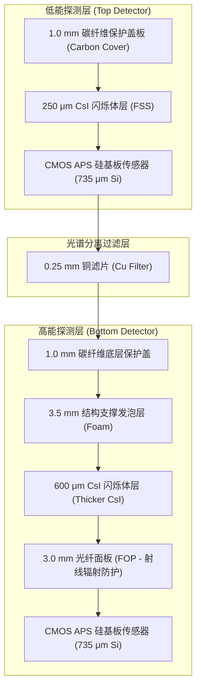

# 《用于双能X射线成像中材料识别与对比度消除的三明治探测器的设计与制造》详细学术阅读报告

本报告针对 Rimcy Palakkappilly Alikunju 等人发表于 Journal of Applied Physics (Vol. 135, No. 15, 2024) 的最新学术论文 《Design and fabrication of a sandwich detector for material discrimination and contrast cancellation in dual-energy based x-ray imaging》（用于双能X射线成像中材料识别与对比度消除的三明治探测器的设计与制造）进行系统化梳理。

报告详细介绍了该“单次曝光（Single-Shot）三明治探测器”的物理原理、多层几何结构设计、双能数据解耦与对比度消除算法，以及实验优化与应用结果，并阐述了其对当前“双能 XRT 矿石快速品位识别”项目的深远指导意义。

---

## 一、 论文概述与核心问题

传统的双能数据采集主要依靠**双电压快速切换（kVp switching）**，即在极短时间内先后进行低能（LE）和高能（HE）两次曝光。这种方法虽然光谱分离度高，但在面对运动物体（如活体胸透、快速传送带上的工业无损探伤、矿石在线分选等）时，两次曝光的时间差会引入严重的**运动伪影 (Motion Artifacts)**，导致图像无法严格配准。

为了实现**单次曝光（Single-Shot）双能成像**，论文自主设计并制造了一种**三明治结构多层能量积分探测器 (Sandwich Detector)**。该探测器：
1. 堆叠了两层具有高空间分辨率（50 $\mu\text{m}$ 像素间距）的 CMOS 先进像素传感器 (APS) 芯片。
2. 上下层分别耦合不同厚度的闪烁体（CsI）以自适应拦截低能与高能光子。
3. 两层传感器中间插入优化厚度的**铜滤片 (Copper Filter)**，利用铜的 K 吸收边滤波特性，在物理上极大地拓宽了上下探测层的光谱分离度。
4. 成功在实物探测器上验证了**材料物理性质 discrimination (原子序数 $Z_e$ 与电子密度 $\rho_e$ 提取)** 以及**双能背景对比度消除 (Contrast Cancellation)** 两大核心任务。

---

## 二、 探测器物理构造与几何设计

探测器物理构造设计是一个高度复杂的能谱过滤与光子拦截权衡过程。论文提出的三明治探测器微观物理剖面如下：

### 各物理层设计考量与参数表：

| 物理层级 | 材料与厚度参数 | 主要物理功能与设计考量 |
| :--- | :--- | :--- |
| **顶层保护盖** | 1.0 mm 碳纤维 | 保护闪烁体，同时具有极低 X 射线衰减，保证低能光子无损穿透。 |
| **顶层闪烁体** | **250 $\mu\text{m}$ CsI** | 优化选取的厚度，旨在拦截吸收绝大部分低能（LE）光子并转换为可见光，同时允许中高能光子顺利穿过。 |
| **顶层传感器** | 735 $\mu\text{m}$ CMOS Si | 50 $\mu\text{m}$ 像素间距 CMOS APS 芯片，完成低能通道的高清图像采集。 |
| **中间过滤层** | **0.25 mm 纯铜 (Cu)** | **光谱分离核心部件**。吸收过滤顶层透射出残余的低能光子，提升下层探测光谱的平均能量（硬化光谱），拉开双能光谱差。 |
| **发泡支撑层** | 3.5 mm 低密度 foam | 提供上下层探测器的机械物理硬支撑与几何隔离，其射线的吸收几乎可忽略不计。 |
| **底层闪烁体** | **600 $\mu\text{m}$ CsI** | 较厚闪烁体设计，以尽可能最大效率拦截、吸收穿透而来的高能（HE）光子。 |
| **底层防护层** | 3.0 mm 光纤面板 (FOP) | 阻挡未被底层闪烁体完全吸收的高能 X 射线直射 CMOS 芯片，**极大延长底层半导体传感器的抗辐射硬化寿命**。 |
| **底层传感器** | 735 $\mu\text{m}$ CMOS Si | 完成高能通道图像的采集。上下层表面间距共 19.5 mm。 |

---

## 三、 核心物理算法原理

本篇论文巧妙融合并应用了两种经典的双能算法理论：

### 1. 基于 Alvarez-Macovski 分解的系统无关 $(\rho_e, Z_e)$ 提取算法
通过将测得的低/高能透射率（$T_{\text{LE}}, T_{\text{HE}}$）按照 Beer-Lambert 定律转化为等效线衰减系数：
$$\mu(E_{\text{LE}}) = -\frac{\ln T_{\text{LE}}}{t},\quad \mu(E_{\text{HE}}) = -\frac{\ln T_{\text{HE}}}{t}$$
将 $\mu$ 代入 Alvarez-Macovski 双能光电-康普顿物理分解式，通过**矩阵反转与除法**直接解耦出光电效应系数 $a_p$ 和康普顿散射系数 $a_c$：
$$\begin{bmatrix} a_p \\ a_c \end{bmatrix} = \begin{bmatrix} E_{\text{LE}}^{-3} & E_{\text{HE}}^{-3} \\ f_{\text{KN}}(E_{\text{LE}}) & f_{\text{KN}}(E_{\text{HE}}) \end{bmatrix}^{-1} \begin{bmatrix} \mu(E_{\text{LE}}) \\ \mu(E_{\text{HE}}) \end{bmatrix}$$

#### 💡 深度学术追问：直接使用矩阵反转与除法，难道没有考虑能谱和探测器响应吗？
这是一个极其深刻且关键的物理学问题。第一篇论文 (Azevedo et al., 2016) 明确指出，双能衰减是连续能谱下的非线性物理积分过程，必须在正向模型中对能谱积分进行非线性数值解耦以消除光谱硬化。

相比之下，本篇论文（Alikunju et al., 2024）为了极大提升计算效率并简化解算流程，采用了一种**等效单能近似模型 (Effective Mono-energetic Approximation)**。在此简化模型中，能谱与探测器的物理响应并没有被忽略，而是通过**间接和隐含**的方式融入了计算管线：

1. **等效平均能量 ($E_{\text{LE}}, E_{\text{HE}}$) 的物理计算**：
   矩阵中的 $E_{\text{LE}}$ 和 $E_{\text{HE}}$ 并不是随意选取的数值，而是射线源连续能谱 $S(E)$ 与对应探测器层物理吸收系数乘积的**有效加权平均能量 (Average Spectral Energy)**。
   - 在 RQA5 能谱（工作电压 70 kV，外加 21 mm 预硬化铝滤片）下，论文通过物理仿真计算出：
     - **低能通道有效平均能量 $E_{\text{LE}} = 50.4\ \text{keV}$**（在顶层 $250\ \mu\text{m}$ CsI 内吸收的光子平均能量）。
     - **高能通道有效平均能量 $E_{\text{HE}} = 56.8\ \text{keV}$**（经过顶层 CsI 与中间 $0.25\ \text{mm}$ 铜片硬化后，在底层 $600\ \mu\text{m}$ CsI 内吸收的光子平均能量）。
   也就是说，**能谱与探测器的响应首先通过这两个有效物理能量点被一次性折算进了解算矩阵中**。

2. **系统标定系数 ($K_1, g, \nu$) 对物理系统偏差的“完全吸纳”**：
   单能近似必然会带来能谱硬化漂移（多色光引起的非线性效应）。为了强力消除这一物理简化带来的偏置，论文引入了校准常数。
   在扫描已知标样（碳、有机玻璃、铝、单晶硅、食盐等）时，将单能矩阵计算出的初级 $a_p$ 和 $a_c$ 与其已知理论物理值对比，通过最小二乘拟合锁定 $K_1$、$g$ 和 $\nu$。
   - **物理本质**：这三个标定系数不仅是比例换算常数，更在数学上**强行吸纳并对冲了由单能近似导致的能谱硬化漂移误差、能谱重叠误差、以及探测器死区与本底散射等一切未建模的系统误差**。

在实际工业应用中（如高速分选），这种等效单能矩阵 division 的最大优势在于其**计算耗时接近于零，极利于像素级超高速实时处理**，而其精度偏置在标样校准空间范围内得到了极其稳健的控制，达到了工业级的最佳平衡。

随后，利用参考标样标定出系统常数 $K_1, g, \nu$，便可提取出任何未知样品的电子密度 $\rho_e$ 与有效原子序数 $Z_e$：
$$\rho_e = K_1 a_c$$
$$Z_e = g \left( \frac{a_p}{a_c} \right)^{1/\nu}$$

### 2. 双能对比度消除技术 (Contrast Cancellation)
在医疗成像或特定的工业无损检测中，经常需要消除背景杂乱基质（如脂肪和肌肉、或某种特定脉石）的对比度干扰，使淹没在其中的目标微小物质（如早期钙化病灶、或极微量致密重金属颗粒）突显出来。

* **双基质线性分解 (Lehmann 等人模型)**：
  将任意测试介质 $\xi$ 的质量衰减系数分解为两种基准物质（$\alpha$ 和 $\beta$，例如纯瘦肉与纯脂肪）的线性组合：
  $$\frac{\mu_\xi(E)}{\rho_\xi} = a_1 \left( \frac{\mu_\alpha(E)}{\rho_\alpha} \right) + a_2 \left( \frac{\mu_\beta(E)}{\rho_\beta} \right)$$
  乘以厚度 $t_\xi$ 和密度 $\rho_\xi$ 得到实验可测得的对数透射值 $M = \ln(I_0 / I)$：
  $$M(E) = A_1 \mu_\alpha(E) + A_2 \mu_\beta(E)$$
  其中 $A_1 = a_1 t_\xi \frac{\rho_\xi}{\rho_\alpha}$ 且 $A_2 = a_2 t_\xi \frac{\rho_\xi}{\rho_\beta}$。

* **求解投影映射系数 $A_1, A_2$**：
  利用三明治探测器一次曝光获取的低能与高能对数衰减投影 $M_{\text{LE}}$ 和 $M_{\text{HE}}$ 联立方程组：
  $$M_{\text{LE}} = A_1 \mu_\alpha(E_{\text{LE}}) + A_2 \mu_\beta(E_{\text{LE}})$$
  $$M_{\text{HE}} = A_1 \mu_\alpha(E_{\text{HE}}) + A_2 \mu_\beta(E_{\text{HE}})$$
  反解该二阶线性方程组，可得各像素点的矢量坐标 $A_1$ 和 $A_2$。

* **对比度消除角 $\phi$ (Contrast Cancellation Angle)**：
  将 $A_1$ 和 $A_2$ 视作基底平面内的二维矢量，引入投影偏置角 $\phi$，合并后的新投影图像灰度 $C$ 为：
  $$C = A_1 \cos\phi + A_2 \sin\phi$$
  若我们希望使背景基质 $\xi$ 和 $\psi$（例如瘦肉与脂肪）之间的图像对比度完全消失（即 $\Delta C = C_\xi - C_\psi = 0$），将两者的 $A_1, A_2$ 带入方程，可严密推导出**对比度消除投影偏置角 $\phi$**：
  $$\phi = \tan^{-1} \left( \frac{\mu_\beta(E_{\text{LE}})(M_{\text{HE},\xi} - M_{\text{HE},\psi}) + \mu_\beta(E_{\text{HE}})(M_{\text{LE},\psi} - M_{\text{LE},\xi})}{\mu_\alpha(E_{\text{LE}})(M_{\text{HE},\xi} - M_{\text{HE},\psi}) + \mu_\alpha(E_{\text{HE}})(M_{\text{LE},\psi} - M_{\text{LE},\xi})} \right)$$
  在此特定角度 $\phi$ 下进行图像投影融合计算，基质 $\xi$ 和 $\psi$ 的图像灰度将变得完全相同，形成均一背景，而第三种介质（如钙化或骨骼）则会以极其清晰的高对比度在白噪背景上完全“浮现”出来。

---

## 四、 实验优化方法与关键定量结果

所有实验均基于符合 IEC 标准的 **RQA5 标准射线束品质**（工作电压 70 kV，钨靶，外加 21 mm 高厚度铝滤片进行预硬化）。

### 1. 多层厚度与中间滤片模拟优化
研究首先利用多能谱正向仿真模型对不同厚度组合进行 $\chi^2$ 偏差测试，探寻对未知样品（NaCl, Al, Si, Plexiglas）进行 $(\rho_e, Z_e)$ 特性估计误差最小的最优几何：

* **测试矩阵**：顶层 CsI 厚度范围 150 ~ 350 $\mu\text{m}$，中间铜滤片厚度 0, 0.25, 0.5 mm。
* **物理平衡**：
  * 若无铜滤片（0 mm），双能能谱重叠极其严重（Spectral Overlap），解耦计算严重退化失真。
  * 若铜滤片过厚（0.5 mm），高能底层接收的光子数被极端削弱，导致底层图像信噪比（SNR）断崖式下跌，量子噪声占主导。

**最优化抉择定量指标 ($\chi^2$ 测试结果)**：
下列为提取出的 $\rho_e$ 和 $Z_e$ 特性值与真实值之间的卡方偏差汇总：

| 铜滤片厚度 (Cu Filter) | 实验 $\rho_e\ \chi^2$ 偏差 | 实验 $Z_e\ \chi^2$ 偏差 | 仿真 $\rho_e\ \chi^2$ 偏差 | 仿真 $Z_e\ \chi^2$ 偏差 | 优选结论 |
| :--- | :---: | :---: | :---: | :---: | :---: |
| **0 mm (无滤片)** | 78.92 | 4.77 | 219.77 | 6.34 | 能谱重叠过高 |
| **0.25 mm (最优滤片)** | **5.06** | **10.43** | **7.47** | **2.65** | **最佳物理平衡点** |
| **0.5 mm (过厚滤片)** | 72.60 | 34.79 | 39.35 | 94.53 | 射线受限，信噪比恶化 |

*定量结论*：**250 $\mu\text{m}$ 顶层 CsI 闪烁体结合 0.25 mm 中间铜滤片**在模拟与实验中均以极低的卡方偏差夺魁，被选定为最终制造该三明治探测器的核心物理参数。

---

### 2. 实物背景对比度消除实验结果
实物测试模型选用**鸡肉的瘦肉与脂肪混合基质**作为杂乱杂质背景，在其上方放置**细碎骨骼块**与**微量钙化沉淀**作为识别靶目标。

* **消退角实验对齐**：通过在 30° 至 60° 投影角度之间进行 1° 精细扫描，实验测得的背景（瘦肉-脂肪）消退角**刚好为 $44^\circ \sim 45^\circ$**，与基于公式 (21) 推导的理论值完全吻合。
* **Rose criterion (罗斯准则) 评估**：
  在图像对比度完全消退后，计算骨骼和钙化在均一背景上的**信噪比 (SNR)**，以检验是否满足人眼与机器稳健检测的最低阈值 $\text{SNR} \ge 5.0$。

**不同铜滤片下的靶物质消退 SNR 统计 (Table VI)**：

| 铜滤片厚度 (mm) | 消退角度 $\phi$ | 骨骼靶 1 SNR | 骨骼靶 2 SNR | 钙化靶 1 SNR | 钙化靶 4 SNR | 罗斯准则判决 ($\ge 5$) |
| :--- | :---: | :---: | :---: | :---: | :---: | :---: |
| **0 mm (无滤片)** | 45° | 4.8 | 4.3 | 4.7 | 2.8 | 不达标 (易漏检) |
| **0.25 mm (最优)** | **44°** | **5.9** | **5.5** | **5.8** | **5.4** | **全达标 (完美检出)** |
| **0.5 mm (过厚)** | 45° | 3.7 | 2.5 | 3.8 | 2.1 | 严重不达标 |

*数据解读*：
在未插入过滤片或滤片过厚时，图像靶材信噪比最大也只有 4.8（低于 5.0 的安全边界）。而**采用 0.25 mm 铜滤片时，所有骨骼与钙化沉淀颗粒的信噪比均稳健超过了 5.4 ~ 5.9**，在平滑均一的背景中以极高对比度跳跃式呈现。

---

## 五、 对“双能 XRT 矿石品位识别”项目的深远指导意义

这篇 2024 年的最新三明治探测器设计论文，对我们当前的**双能 XRT 矿石品位快速在线识别**项目具有极其关键的算法与硬件指导意义：

1. **单次曝光对工业矿石传送带分选的必要性**
   - 矿山现场分选要求矿石在快速传送带上高速通过 XRT 扫描区域（速度通常为 2 ~ 4 m/s）。
   - 双电压切换法（kVp switching）在如此高速下会造成低能和高能图像产生数厘米的空间错位，边缘重合度极差。
   - 论文从原理上确立了**单次曝光三明治多层成像**是消除高速运动伪影、实现像素级 $apd$ 和 $acd$ 精准提取与 $Z_e$ 解耦的唯一工业化道路。

2. **R值拓宽与能谱重叠（Spectral Overlap）治理**
   - 我们的双能系统在面临高致密、高原子序数的铜/铁矿石分选时，经常遇到高低能 $R$ 值曲线相互缠绕、分类决策边界狭窄的问题。
   - 这正是由于能谱重叠引起的。论文通过引入 **0.25 mm 铜滤片** 成功拉开光谱差的做法给予了我们重大启示：**在双能 XRT 的低能和高能通道之间加入特定厚度的滤片进行能谱物理分割，是拓宽品位识别决策空间（R 值边界）最直接、成本最低且最有效的方法。**

3. **双能对比度消除技术的跨界应用**
   - 矿石由“脉石基质”（SiO2, CaCO3 等低 Z 杂质）和“精矿靶区”（黄铜矿 CuFeS2, 黄铁矿 FeS2 等高 Z 目标）复杂包裹组成。
   - 我们可以直接将论文中的 **对比度消除角 $\phi$ (Equation 21)** 算法移植到矿石图像融合中：以“脉石基质”作为消退背景基底，求解其消退角度。
   - 投影融合后，**可彻底消除脉石矿物由于几何厚度起伏带来的灰度伪影干扰**，使隐藏在矿石内部的细微“铜/铁重元素富集脉络”以极高的信噪比（SNR $\ge 5$）凸显出来，大幅提升在线矿石品位的识别准确率！
